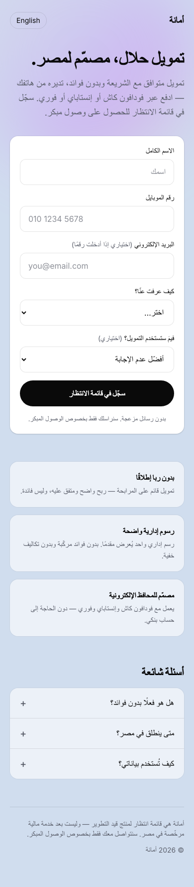

# Amanah — Shariah-compliant financing waitlist (Egypt)

A standalone, SEO-discoverable waitlist page that tests appetite for a **halal, interest-free
financing product in Egypt**. Independent of any main app: a fast, mobile-first Next.js page that
captures qualified signups and writes them to Postgres (Supabase).


<p align="center">
  
  &nbsp;&nbsp;
  
</p>
<p align="center"><em>English (<code>/</code>) and Arabic RTL (<code>/ar</code>).</em></p>

> **Design note:** the palette (periwinkle base, black ink, iridescent aurora accent) and type
> (Outfit + Inter) are matched to [Mal](https://mal.ai/)'s brand — palette only, original wordmark,
> no Mal assets. Details in [`DESIGN.md`](DESIGN.md).

---

## Try it live

- **English:** https://market-waitlist.vercel.app
- **Arabic (RTL):** https://market-waitlist.vercel.app/ar

To try the form, use any valid Egyptian mobile — networks **010 / 011 / 012 / 015**. Copy-paste any of:

| `01012345678` | `01198765432` | `01234567890` | `01555555555` |
|---|---|---|---|

`+20` / `0020` prefixes also work (`+201012345678`), and spaces/dashes are fine. Email works instead of a phone (either one is required). Submitting the same number twice returns the *same* referral code — that's the dedupe, not an error.

## Why Egypt

Mal is Abu-Dhabi-based with a stated Middle-East rollout, so Egypt is the market you'd realistically
enter next: ~110M people, majority-Muslim, two-thirds of adults without formal credit access, mature
mobile-money rails (Vodafone Cash, InstaPay, Fawry), and consumer-lending fintechs (valU, Sympl,
MNT-Halan) already scaling — with Shariah-compliant financing the under-served flank. Full market and
SEO reasoning is in [`docs/PART2.md`](docs/PART2.md).

## Stack & rationale

| Layer | Choice | Why |
|-------|--------|-----|
| Framework | **Next.js 15** (App Router, TS) | Server-rendered, crawlable HTML + fast mobile load with no client framework tax |
| Styling | **Tailwind CSS v4** | Token-driven, zero runtime CSS |
| Database | **Supabase (Postgres)** | Managed Postgres + REST; the migration is plain SQL, portable to any Postgres |
| Validation | **Zod** + a pure phone normalizer | One shared module for client and server, unit-tested |
| Tests | **Vitest** | Fast, covers the validation + DB-error logic (the write path's heart) |
| Hosting | **Vercel** | First-class Next.js SSR/SSG + serverless routes |

**Rendering:** the two localized pages (`/`, `/ar`) are **server-rendered** — a deliberate trade of
build-time static for i18n correctness, so each locale gets a correct `<html lang>`/`dir` (a
client-side lang fix would leave crawlers and the browser's translate heuristic seeing the wrong
language). The HTML is fully crawlable and the client bundle is unchanged (~119 kB first load); the
SEO files (`sitemap.xml`, `robots.txt`) stay static. The one other server endpoint is the route
handler (`POST /api/waitlist`). The build intentionally does **not** use `output: 'export'`, which
would drop the API route. This is what carries the Lighthouse mobile target (≥ 85).

## Quick start

**Prerequisites:** Node 20+, npm, and a free [Supabase](https://supabase.com) project.

```bash
# 1. install
npm install

# 2. configure — copy the template and fill in your Supabase values
cp .env.example .env.local

# 3. run
npm run dev            # http://localhost:3000

# tests / checks
npm test               # 36 Vitest cases
npm run typecheck
npm run build          # production build
```

### Environment variables

| Variable | Scope | Purpose |
|----------|-------|---------|
| `NEXT_PUBLIC_SUPABASE_URL` | client + server | Supabase project URL (`https://<ref>.supabase.co`) |
| `SUPABASE_SERVICE_ROLE_KEY` | **server only** | Service-role / "secret" key. Bypasses RLS; used only by the API route. Never expose it. |
| `NEXT_PUBLIC_SITE_URL` | client + server | Canonical origin for metadata / OG / (upcoming) sitemap. No trailing slash. |

> Supabase renamed its keys: the **"Secret key"** (`sb_secret_…`) is the value for
> `SUPABASE_SERVICE_ROLE_KEY`. Ignore the "Publishable" (anon) key — the app never uses it, because
> all database access is server-side.

## Database

One table, `waitlist_signups`, captures: full name, **email or phone** (at least one — phone is the
primary identity for Egypt's underbanked), self-reported referral source, an **optional intent
signal** (`financing_purpose`, asset-backed values only), `market`, a **referral code + referrer**
(`ref_code` / `referred_by`) for a WhatsApp share loop, UTM columns, and a timestamp. Security is
**Row Level Security with deny-all** — the browser's anon key can never touch the table; the server
route writes with the service-role key. A `demand_report` view (in a non-exposed `private` schema, so
it can't leak over the anon REST API) slices signups by the axes growth cares about.

Full, self-documenting DDL: [`supabase/migrations/0001_init.sql`](supabase/migrations/0001_init.sql).

### Applying the migration

**Option A — Supabase SQL Editor (simplest):** paste the contents of
`supabase/migrations/0001_init.sql` into a new query and Run.

**Option B — Supabase CLI:**
```bash
supabase link --project-ref <your-ref>
supabase db push
```

**Option C — psql:**
```bash
psql "$DATABASE_URL" -f supabase/migrations/0001_init.sql
```

Read the demand report (SQL Editor or a service-role connection):
```sql
select * from private.demand_report;
```

## Deployment (Vercel)

1. Import the GitHub repo into Vercel (framework auto-detected as Next.js).
2. Add the three env vars above under **Settings → Environment Variables** (server scope for the
   secret key). Set `NEXT_PUBLIC_SITE_URL` to the deployed origin.
3. Deploy. Smoke-test a real signup against the **live** URL (not localhost), then check the row in
   Supabase.

## SEO

Implemented and verified against the production server: descriptive `<title>` + meta description,
OpenGraph/Twitter cards, `metadataBase` canonical, `Organization` + `WebPage` JSON-LD
(`areaServed: Egypt`), [`app/sitemap.ts`](app/sitemap.ts) and [`app/robots.ts`](app/robots.ts), and a
bilingual **`hreflang`** pair (`en-EG` / `ar-EG` / `x-default`) across the `<head>` and the sitemap,
pointing at the English `/` and Arabic `/ar` routes. `FAQPage` markup is deliberately omitted —
Google restricted FAQ rich results to gov/health in 2023 — but the FAQ content stays for long-tail
relevance.

## Project structure

```
app/
  layout.tsx           # fonts (Outfit/Inter) + SEO metadata
  page.tsx             # the waitlist page (hero, form, trust strip, FAQ)
  globals.css          # Tailwind v4 + Mal-matched design tokens
  api/waitlist/route.ts# POST endpoint: validate → insert → constraint-aware dedupe
components/
  waitlist-form.tsx    # form island: states, honeypot, WhatsApp share
lib/
  validation.ts        # shared Zod schema + Egyptian phone normalizer
  db-errors.ts         # 23505 constraint classifier
  supabase.ts          # server-only service-role client
  *.test.ts            # 36 Vitest cases
supabase/migrations/
  0001_init.sql        # schema + RLS + demand_report view + grants
DESIGN.md              # design system (tokens, type, rules)
```

## Build status

**Complete and deployed.** Verified: scaffold, schema/migration, shared validation (36 tests green),
page + form with all interaction states, `POST /api/waitlist` with constraint-aware dedupe (tested
live against Supabase), the full SEO layer (JSON-LD, sitemap, robots, hreflang), the bilingual
**`/ar` Arabic RTL route**, and the [live Vercel deploy](https://market-waitlist.vercel.app). The
architecture/SEO/trade-offs write-up is in [`docs/PART2.md`](docs/PART2.md).

## What I'd do next (with 2 more hours)

The rule: **make the demand data trustworthy before making it bigger.** This page exists to measure
appetite, so anything that hardens the measurement outranks anything that grows it.

1. **Protect the signal (~45 min).** Sliding-window IP rate limit on `POST /api/waitlist` (Upstash
   Ratelimit at the edge) + validate `referred_by` against existing codes with one indexed `SELECT`.
   Today the appetite numbers are script-inflatable; this makes them defensible before any paid
   traffic runs.
2. **Close the referral loop (~30 min).** Show a live referral count on the success screen ("You've
   referred 3 friends") — turns the WhatsApp share from a hopeful button into a visible score, the
   cheapest K-factor lever available.
3. **Make the measurement readable (~25 min).** Custom analytics events (signup, share-click, locale)
   plus a `demand.sql` one-pager, so anyone on the growth team can read `demand_report` without me.
4. **Deepen Arabic (~20 min).** An Arabic OG card so WhatsApp/Facebook shares render in-language, and
   queue a native-speaker pass on the MSA copy.

Still deliberately out, even with the extra time: admin dashboard, OTP verification, captcha, i18n
framework — none of them changes what this test can measure.

## License

MIT (placeholder — this is an assessment project).
